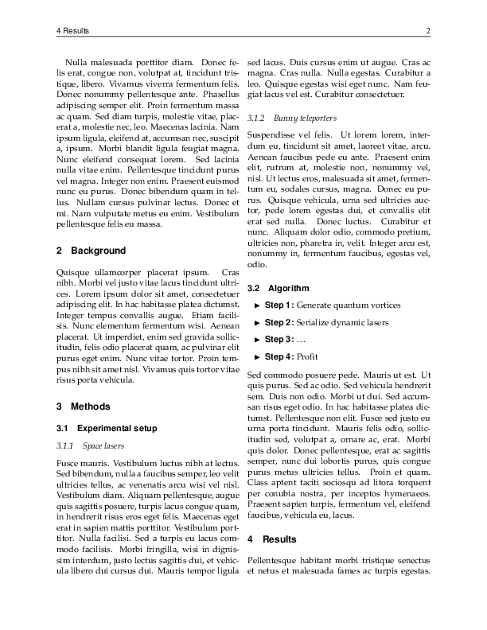
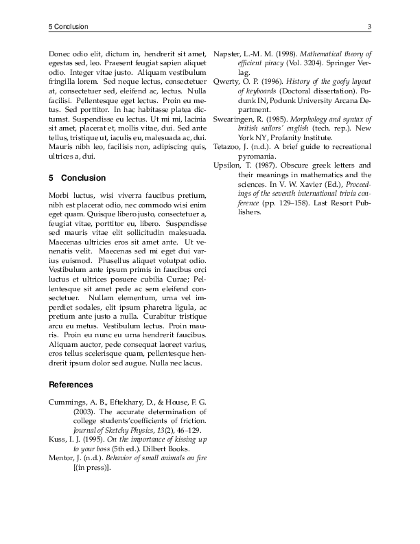

# paper-enhanced

An improvement of the LaTeX paper document class (https://ctan.org/pkg/paper).

## Install

Copy the `paperenhanced.cls` file to your LaTeX package directory, e.g. `~/texmf/tex/latex/local` for TeXLive. 

## Example

## Usage

### Structure

This documentclass adds some layout tweaks and modifies the default `\maketitle` layout.
The class also defines the front matter of the paper, which contains entries such as the paper's abstract, keywords
extra user specified values.

### Commands

`\makefrontmatter`  
Print the front matter.

`\subtitle{#1}`  
Specify the paper's subtitle to be printed below the title.

`\abstract{#1}`  
Specify the paper's abstract to be printed in the front matter.

`\keywords{#1}`
Specify the paper's keywords to be printed in the front matter.

`\fmextra{#1}{#2}`
Specify an extra entry in the front matter with title `#1` and value `#2`, e.g.
`\fmextra{Funding}{FWO Fundamental Research Grant}` generates  
"**Funding**&nbsp;&nbsp;&nbsp;FWO Fundamental Research Grant"  
in the front matter.

`\textbsf{#1}`
Shorthand for `\textbf{\textsf{#1}}`.

### Documentclass options

* `toc`: generate a table of contents in the front matter
* `tof`: generate a table of figures in the front matter
* `tos`: generate a table of symbols in the front matter
* `frontpage`: print the title and front matter on a separate page
* options of the `paper` documentclass (TODO)